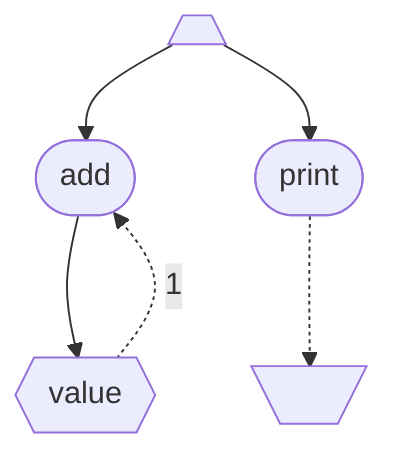

# Brigadierにおけるコマンドの仕組み（1.2.9）

## はじめに

> [!NOTE]
> この記事は[Minecraft Command Advent Calendar 2023](https://qiita.com/advent-calendar/2023/mccmd)の4日目の記事です。

この記事は、コマンドの仕組みを詳細に解説するシリーズの前半です。
18日目に公開予定の後半「[Minecraftにおけるコマンドの仕組み（1.20.3）](https://github.com/intsuc/mcac2023/blob/main/Minecraft.md)」の前提知識となる内容を扱っています。

この記事は、コマンドにある程度慣れている方がコマンドの仕組みをより深く理解することを目的としています。
そのため、

> [!CAUTION]
> 

>
> ### **この記事はコマンド入門用ではありません！**[^1]
> 

## Brigadierとは

Minecraftのコマンドは、[**Brigadier**](https://github.com/Mojang/brigadier)というライブラリを使って実装されています。
Brigadierはコマンドを定義したり、パース（文字列を解析や実行に適した形式に変換すること）したり、実行したりする機能を提供します。

Minecraftにおけるコマンドの仕組みを理解する上で、Brigadierの仕組みを理解することは欠かせません。
まずはMinecraftのことを一旦忘れて、Brigadierの仕組みについて見ていきましょう。

> [!IMPORTANT]
> この記事では、執筆時点で最新のBrigadierのバージョンである1.2.9を前提としています。

## コマンドを定義する

コマンドをパースしたり実行したりするためには、まずコマンドを定義する必要があります。
Brigadierでは、コマンドを[木構造](https://ja.wikipedia.org/wiki/%E6%9C%A8%E6%A7%8B%E9%80%A0_(%E3%83%87%E3%83%BC%E3%82%BF%E6%A7%8B%E9%80%A0))で表現します。
この木構造は**コマンド木**と呼ばれます。

### コマンドノード

コマンド木のノードは**コマンドノード**と呼ばれており、以下の3種類があります。
- ルートコマンドノード
- リテラルコマンドノード
- 引数コマンドノード

コマンドノードは0個以上のコマンドノードを子に持つことができます。
ただし、ルートコマンドノードの親ノードは存在しません。

全てのコマンドノードは文字列の名前を持ちます。
コマンドノードの名前は、兄弟ノード間で一意である必要があります。
つまり、あるコマンドノードは同じ名前を持つコマンドノードを2個以上子に持つことはできないということです。
この性質により、ルートコマンドノードからの名前の列によって、コマンド木内のコマンドノードを一意に特定することができます。

#### ルートコマンドノード

**ルートコマンドノード**は名前の通り、コマンド木のルートになるコマンドノードです。
1つのコマンド木には必ず1つのルートコマンドノードが存在します。
ルートコマンドノードの名前は空の文字列です。

ルートコマンドノードを以下のように可視化することにします。

#### リテラルコマンドノード

**リテラルコマンドノード**は`foo`や`bar`などのリテラル(文字列)を持つコマンドノードです。
複数のコマンドを区別し、人間にとって分かりやすい意味をコマンドに持たせるために使われます。
リテラルコマンドノードの名前はそれが持つリテラルです。

例として、リテラルの`foo`を持つリテラルコマンドノードを以下のように可視化することにします。

#### 引数コマンドノード

**引数コマンドノード**はブール型や整数型などの引数型を持つコマンドノードです。
特定の型を持つ引数の値を受け取って使用するようなコマンドを定義するために使われます。
引数コマンドノードの名前は自由に決めることができ、通常はその引数の用途を表す名前になります。
引数型は自由に追加することができます。

Brigadierは標準の引数型として以下のものを提供しています。
各引数型にはオプションとして最小値や最大値などの制約を設定することができます。
- Bool : ブール型
- Integer : 符号付き32ビット整数の型
  - 最小値
  - 最大値
- Long : 符号付き64ビット整数の型
  - 最小値
  - 最大値
- Float : 単精度浮動小数点数（IEEE 754-2019 binary32）から±∞とNaNを除いたものの型
  - 最小値
  - 最大値
- Double : 倍精度浮動小数点数（IEEE 754-2019 binary64）から±∞とNaNを除いたものの型
  - 最小値
  - 最大値
- String : Javaの文字列(`java.lang.String`)の型
  - 単語
  - 引用符で囲めるフレーズ
  - 残りの文字列全て

例として、名前が`flag`の引数コマンドノードを以下のように可視化することにします。（引数型はBoolとします。）

コマンド木の例を以下に示します。

### コマンドノードを実行可能にする

コマンドノードを繋いだだけでは実行できるコマンドを定義することはできません。
そのためには、どのコマンドノードが実行可能で、どのような処理を持っているのかを定義する必要があります。

例えば、以下のようなコマンドのみを実行できるようにしたいとします。
- `foo`
- `foo true`
- `foo false`
- `bar baz`

これは、`foo`と`<flag>`と`baz`に対応するコマンドノードが実行可能であり、`bar`に対応するコマンドノードは実行可能でないことを意味します。

あるコマンドノードが実行可能であることを、そのコマンドノードから

への点線矢印で表現することにします。

すると、上の条件を満たすコマンド木は以下のようになります。

紛らわしいですが、実行可能なコマンドノードが持っている処理（図中の点線矢印に対応）が**コマンド**と呼ばれています。
コマンドはコマンドコンテキスト（後述）を受け取って、コマンド構文例外（後述）を発生させるか、符号付き32ビット整数を返します。

> [!NOTE]
> コマンドコンテキストについては後の章で詳しく説明します。
> 現時点ではコマンド実行に必要なものだと考えてください。

> [!NOTE]
> コマンド構文例外については後の章で詳しく説明します。
> 現時点ではコマンドに関するエラーを表すものだと考えてください。

### コマンドノードをフォワードする

コマンドノードを別のコマンドノードへ**フォワード**すると、フォワード先のコマンドノードの子ノードを実質的にフォワード元のコマンドノードの子ノードとして扱うことができます。

フォワードには主に以下の3種類があります。
- エイリアス
- リダイレクト
- フォーク

#### エイリアス

**エイリアス**は最も単純なフォワードです。
エイリアス先のコマンドノードの子ノードを実質的にエイリアス元のコマンドノードの子ノードとして扱うことができるだけです。

例えば、以下のようなコマンド木を考えます。

`foo <flag>`というコマンドが定義されています。
このコマンドを`f <flag>`でも実行できるようにするには、`f`から`foo`へのエイリアスを追加し、`<flag>`を実質的に`f`の子ノードにすれば良いです。
これを以下のように可視化することにします。

また、あるコマンドノードからその先祖ノードへのエイリアスを追加することで、以下のようにコマンド木に実質的なループを作ることができます。

上のコマンド木に対して、例えば以下のようなコマンドが実行可能になります。
- `foo true`
- `foo run foo true`
- `foo run foo run foo true`
- `foo run foo run foo run foo true`
- ...

> [!TIP]
> それぞれのコマンドについて、上のコマンド木をルートコマンドノードから指で辿ってみてください。

#### リダイレクト

**リダイレクト**は、リダイレクト先のコマンドノードの子ノードを実質的にリダイレクト元のコマンドノードの子ノードとして扱うことができるだけでなく、その際に**単一リダイレクト修飾子**を実行することができます。
単一リダイレクト修飾子はコマンドコンテキストを受け取って、コマンド構文例外を発生させるか、コマンドソース（後述）を返します。

> [!NOTE]
> コマンドソースについては後の章で詳しく説明します。
> 現時点ではコマンドの利用者（コマンドをパースしたり、実行したりするもの）だと考えてください。

リダイレクトをラベル`1`付きの点線矢印で表現することにします。

例えば、以下のようなコマンド木を考えてみましょう。

更に、以下のような実装を仮定します。
- コマンドソースは整数
- `<value>`からのリダイレクトにおける単一リダイレクト修飾子は「受け取ったコマンドコンテキストが持つコマンドソースに`<value>`を足した新しいコマンドソースを返す」
- `print`が持つコマンドは「受け取ったコマンドコンテキストが持つコマンドソースを出力する」
- コマンドを実行する際の初期コマンドソースは`0`

これにより、例えば以下のようなコマンドが実行可能になります。
それぞれのコマンドを実行した際の出力を矢印の右側に示します。
- `print` → `0`
- `add 1 print` → `1`
- `add 1 add 1 print` → `2`
- `add 1 add 1 add 1 print` → `3`
- `add 2 add 3 print` → `5`

> [!TIP]
> それぞれのコマンドについて、上のコマンド木をルートコマンドノードから指で辿ってみてください。

先述したエイリアスは、リダイレクトと組み合わせることで真価を発揮します。
毎回`add`と入力するのが面倒なので`add 1 2 3`のように`<value>`を連続して入力できるようにしたいとします。
これを実現するには、`<value>`からルートコマンドノードにリダイレクトする代わりに、`add`にリダイレクトすれば良いです。

しかし、これだけでは`add`と`<value>`のループに入った後、実行可能である`print`まで到達することができません。
そこで、ループを終了させるための`run`というリテラルコマンドノードを`add`の子として追加し、`run`からルートコマンドノードへのエイリアスを追加します。

`run`をルートコマンドノードにフォワードさせている理由は、加工されたコマンドソース下で再び任意のコマンドを実行できるようにするためなので、この時に何らかの処理を実行してコマンドソースを加工する必要はありません。
そのため、このフォワードはエイリアスで十分です。

これにより、例えば以下のようなコマンドが実行可能になります。
それぞれのコマンドを実行した際の出力を矢印の右側に示します。
- `print` → `0`
- `add run print` → `0`
- `add 1 run print` → `1`
- `add 1 1 run print` → `2`
- `add 1 1 1 run print` → `3`
- `add 2 3 run print` → `5`
- `add 2 3 run add 4 run print` → `9`

> [!TIP]
> それぞれのコマンドについて、上のコマンド木をルートコマンドノードから指で辿ってみてください。

#### フォーク

**フォーク**は、フォーク先のコマンドノードの子ノードを実質的にフォーク元のコマンドノードの子ノードとして扱うことができるだけでなく、その際に**リダイレクト修飾子**を実行することができます。
リダイレクト修飾子はコマンドコンテキストを受け取って、コマンド構文例外を発生させるか、0個以上のコマンドソースを返します。
先述した単一リダイレクト修飾子はリダイレクト修飾子の特別な場合であると考えることができるため、これらを合わせて単にリダイレクト修飾子と呼ぶことがあります。

フォークをラベル`*`付きの点線矢印で表現することにします。

例えば、以下のようなコマンド木を考えてみましょう。

更に、以下のような実装を仮定します。
- コマンドソースは文字列
- `split`からのフォークにおけるリダイレクト修飾子は「受け取ったコマンドコンテキストが持つコマンドソースを1文字ずつに分割した1文字の文字列のリストを新しいコマンドソースとして返す」
- `<value>`からのリダイレクトにおける単一リダイレクト修飾子は「受け取ったコマンドコンテキストが持つコマンドソースの末尾に`<value>`を追加した新しいコマンドソースを返す」
- `print`が持つコマンドは「受け取ったコマンドコンテキストが持つコマンドソースを出力する」
- コマンドを実行する際の初期コマンドソースは`""`(空の文字列)

これにより、例えば以下のようなコマンドが実行可能になります。
それぞれのコマンドを実行した際の出力を矢印の右側に示します。
出力が複数回行われる場合は、出力をコンマで区切って示します。
- `print` → `""`
- `append "a" print` → `"a"`
- `append "a" append "bc" print` → `"abc"`
- `append "abc" split print` → `"a"`, `"b"`, `"c"`
- `append "abc" split append "!" print` → `"a!"`, `"b!"`, `"c!"`
- `append "abc" split append "!" split print` → `"a"`, `"!"`, `"b"`, `"!"`, `"c"`, `"!"`

上の結果が示すように、フォークのリダイレクト修飾子が返す複数のコマンドソースには順序があり、その順序に従ってそれぞれのコマンドソース下での実行が行われます。

## コマンドをパースする

定義されたコマンドを実行するためには、まず入力された文字列をパースする必要があります。
パースとは、文字列を解析や実行に適した形式に変換することです。

### コマンドソース

コマンドをパースしたり実行したりするには、**コマンドソース**と呼ばれるコマンドの利用者が必要です。

パース時には、コマンドソースに応じて特定のコマンドノードを隠す（存在しないことにする）ことができます。
この機能は、例えば権限に応じて使用できるコマンドを制限するために使われます。

### パース結果

Brigadierにおけるパース自体は必ず成功し、**パース結果**を出力します。
パース結果をどう解釈するかはそれを使う側の責任です。
パース結果は以下の要素からなります。
- 0個以上のコマンド構文例外
- 文字列リーダー
- コマンドコンテキストビルダー

#### コマンド構文例外

**コマンド構文例外**は、パース中に発生した構文エラーです。
コマンド構文例外が発生するのは、引数コマンドノードのパース時です。
例えば、整数を期待する引数コマンドノードに対して`foo`のような整数として解釈できない文字列を与えた時などです。

> [!IMPORTANT]
> この記事では、話を簡単にするためにコマンド構文例外が発生しないようなコマンドの定義及び入力のみを考えます。

#### 文字列リーダー

**文字列リーダー**は、入力された文字列とそれをどこまで読んだかを表すカーソルを持っています。

#### コマンドコンテキストビルダーとコマンドコンテキスト

**コマンドコンテキストビルダー**は、文字列を与えてビルドすることで**コマンドコンテキスト**になります。
コマンドコンテキストは主に以下の要素からなります。
- 1個のコマンドソース
- 最大1個のリダイレクト修飾子
- 最大1個のコマンド
- 0個以上の引数
- 最大1個の子コマンドコンテキスト

パース結果のコマンドコンテキストやその子孫コマンドコンテキストが持つコマンドソースは、全てパース時に与えられたコマンドソースです。

引数はリダイレクト修飾子やコマンドの実行時に使用されます。
コマンドコンテキストは最大1個のリダイレクト修飾子とコマンドしか持てないので、フォワードがある場合は新たなコマンドコンテキストが生成され、現在のコマンドコンテキストの子になります。
そのため、コマンドコンテキストは[連結リスト](https://ja.wikipedia.org/wiki/%E9%80%A3%E7%B5%90%E3%83%AA%E3%82%B9%E3%83%88)になります。

例えば、[リダイレクト](#リダイレクト)における`add 2 3 run print`は最終的に以下のような4個のコマンドコンテキストになります。

上の図を見て分かる通り、コマンドコンテキストはコマンド木に含まれるコマンドノードをどのような引数でどのように辿っていくかを表していると考えることができます。

コマンドコンテキストは必ずしも実行可能なコマンドを持つとは限りません。
例えば、[リダイレクト](#リダイレクト)における`add 2 3`は最終的に以下のようなコマンドコンテキストになります。

## コマンドの実行

コマンドを定義し、パースすることができたら、ようやくコマンドを実行することができます。

先述したように、パース結果をどう解釈するかはそれを使う側の責任ですが、Brigadierにはそれを行うための標準的な仕組みが用意されています。
この章ではこの標準的な仕組みについて解説します。

標準的なコマンド実行は、コマンド構文例外の発生によって途中で終了する可能性があります。
コマンド構文例外が最後まで発生しなかった場合は、符号付き32ビット整数が返されます。

### 結果消費子

コマンドの実行には**結果消費子**が必要です。
結果消費子は以下の要素を受け取って何らかの処理を行うことができます。
- コマンドコンテキスト
- 成否(成功か失敗)
- 結果(符号付き32ビット整数)

結果消費子はコマンド実行中に0回以上呼び出されます。

### バリデーション

コマンド実行の最初に、パース結果のバリデーションを行います。
パース結果の文字列リーダーが最後まで文字列を読んでいない場合、コマンド構文例外を発生させ、コマンド実行は終了します。
この場合、結果消費子は呼び出されません。

### ビルド

バリデーションが済んだら、パース結果の文字列リーダーの文字列をパース結果のコマンドコンテキストビルダーに与えてビルドし、コマンドコンテキストを生成します。

### 平坦化

ビルドが済んだら、そのコマンドコンテキストを平坦化します。
平坦化は連結リストであるコマンドコンテキストを**コンテキストチェーン**に変換する処理です。
コンテキストチェーンは以下の要素（**ステージ**）からなります。
- 0個以上の修飾子コマンドコンテキスト
- 1個の実行可能コマンドコンテキスト

修飾子コマンドコンテキストは、その最後のコマンドノードがその子コマンドコンテキストの最初のコマンドノードにフォワードしているコマンドコンテキストです。
実行可能コマンドコンテキストは、その最後のコマンドノードがコマンドを持つコマンドコンテキストです。

平坦化によって、コマンドコンテキストの連結リストの内、最後以外のコマンドコンテキストは修飾子コマンドコンテキストになり、最後のコマンドコンテキストは実行可能コマンドコンテキストになります。
先述したように最後のコマンドコンテキストがコマンドを持つとは限らないため、平坦化は失敗する可能性があります。
平坦化に失敗すると、最初のコマンドコンテキストと失敗と0を結果消費子に与えて呼び出し、コマンド構文例外を発生させ、コマンド実行は終了します。

### コンテキストチェーンの実行

平坦化が済んでコンテキストチェーンが得られたら、コンテキストチェーンを実行します。
コンテキストチェーンの実行にはコマンドソースが必要です。
このコマンドソースには、ビルドされたコマンドコンテキストが持つコマンドソースが使われます。

#### 実行可能コマンドコンテキストのみの場合

まずは簡単な場合から見ていきましょう。
コンテキストチェーンが0個の修飾子コマンドコンテキストと1個の実行可能コマンドコンテキストからなる場合です。

##### アルゴリズム

1. 実行可能コマンドコンテキストが持つコマンドに、実行可能コマンドコンテキスト自身をコマンドコンテキストとして渡して実行する。
    1. コマンドがコマンド構文例外を発生させず符号付き32ビット整数を結果として返した場合、以下の処理を行う。
        1. 実行可能コマンドコンテキストと成功とコマンドの結果を結果消費子に与えて呼び出す。
        2. コマンドの結果を返し、コマンド実行を終了する。
    2. コマンドがコマンド構文例外を発生させた場合、以下の処理を行う。
        1. 実行可能コマンドコンテキストと失敗と0を結果消費子に与えて呼び出す。
        2. コマンド構文例外を発生させ、コマンド実行を終了する。

#### フォークしない修飾子コマンドコンテキストを持つ場合

次は、コンテキストチェーンが1個以上の修飾子コマンドコンテキストと1個の実行可能コマンドコンテキストからなる場合です。
ただし、全ての修飾子コマンドコンテキストはフォークしないものとします。

この場合、以下の要素が実行環境になります。
- 現在のコマンドソース（初期値はビルドされたコマンドコンテキストが持つコマンドソース）

##### アルゴリズム

1. それぞれの修飾子コマンドコンテキスト`m`について、以下の処理を行う。
    1. 現在のコマンドソース`s`について以下の処理を行い、コマンドソースを得る。
        1. `m`がエイリアスの場合、`s`のみを含むコマンドソースリストを得る。
        2. `m`がリダイレクトの場合、以下の処理を行う。
            1. `m`のコマンドソースを`s`で置き換えた新しいコマンドコンテキスト`m'`を生成する。
            2. `m`が持つ単一リダイレクト修飾子に`m'`を渡して実行する。
                1. リダイレクト修飾子がコマンド構文例外を発生させなかった場合、得られたコマンドソースのみを含むコマンドソースリストを得る。
                2. リダイレクト修飾子がコマンド構文例外を発生させた場合、以下の処理を行う。
                    1. 結果消費子に`m'`と失敗と0を与えて呼び出す。
                    2. コマンド構文例外を発生させ、コマンド実行を終了する。
    2. 得られたコマンドソースを、新しい現在のコマンドソースとする。
2. 現在のコマンドソース`s`について以下の処理を行い、符号付き32ビット整数を得る。
    1. 実行可能コマンドコンテキスト`e`のコマンドソースを`s`で置き換えた新しいコマンドコンテキスト`e'`を生成する。
    2. `e`が持つコマンドに`e'`を渡して実行する。
        1. コマンドがコマンド構文例外を発生させず符号付き32ビット整数を結果として返した場合、以下の処理を行う。
            1. `e'`と成功とコマンドの結果を結果消費子に与えて呼び出す。
            2. コマンドの結果を得る。
        2. コマンドがコマンド構文例外を発生させた場合、以下の処理を行う。
            1. `e'`と失敗と0を結果消費子に与えて呼び出す。
            2. コマンド構文例外を発生させ、コマンド実行を終了する。
3. 符号付き32ビット整数を返し、コマンド実行を終了する。

#### 修飾子コマンドコンテキストを持つ場合

最後は、コンテキストチェーンが1個以上の修飾子コマンドコンテキストと1個の実行可能コマンドコンテキストからなる場合です。

この場合、以下の要素が実行環境になります。
- フォーク済み（初期値は偽）
- 現在のコマンドソースリスト（初期値はビルドされたコマンドコンテキストが持つコマンドソースのみを含むリスト）

一度でもフォークが発生した場合、リダイレクト修飾子の実行中に発生するコマンド構文例外は無視されるようになり、最終的な実行結果はコマンド構文例外が発生しなかったコマンドソースの数になります。

##### アルゴリズム

1. それぞれの修飾子コマンドコンテキスト`m`について、以下の処理を行う。
    1. それがフォークしている場合、フォーク済みを真にする。
    2. 現在のコマンドソースリストのそれぞれのコマンドソース`s`について以下の処理を行い、コマンドソースリストのリストを得る。
        1. `m`がエイリアスの場合、`s`のみを含むコマンドソースリストを得る。
        2. `m`がリダイレクトの場合、以下の処理を行う。
            1. `m`のコマンドソースを`s`で置き換えた新しいコマンドコンテキスト`m'`を生成する。
            2. `m`が持つ単一リダイレクト修飾子に`m'`を渡して実行する。
                1. リダイレクト修飾子がコマンド構文例外を発生させなかった場合、得られたコマンドソースのみを含むコマンドソースリストを得る。
                2. リダイレクト修飾子がコマンド構文例外を発生させた場合、結果消費子に`m'`と失敗と0を与えて呼び出し、以下の処理を行う。
                    1. フォーク済みが真の場合、空のコマンドソースリストを得る。
                    2. フォーク済みが偽の場合、コマンド構文例外を発生させ、コマンド実行を終了する。
        3. `m`がフォークの場合、以下の処理を行う。
            1. `m`のコマンドソースを`s`で置き換えた新しいコマンドコンテキスト`m'`を生成する。
            2. `m`が持つリダイレクト修飾子に`m'`を渡して実行する。
                1. リダイレクト修飾子がコマンド構文例外を発生させなかった場合、得られたコマンドソースリストを得る。
                2. リダイレクト修飾子がコマンド構文例外を発生させた場合、結果消費子に`m'`と失敗と0を与えて呼び出し、以下の処理を行う。
                    1. フォーク済みが真の場合、空のコマンドソースリストを得る。
                    2. フォーク済みが偽の場合、コマンド構文例外を発生させ、コマンド実行を終了する。
    3. 得られたコマンドソースリストのリストを順に結合し、新しい現在のコマンドソースリストとする。
    4. 現在のコマンドソースリストが空の場合、0を返し、コマンド実行を終了する。
2. 現在のコマンドソースリストのそれぞれのコマンドソース`s`について以下の処理を行い、符号付き32ビット整数のリストを得る。
    1. 実行可能コマンドコンテキスト`e`のコマンドソースを`s`で置き換えた新しいコマンドコンテキスト`e'`を生成する。
    2. `e`が持つコマンドに`e'`を渡して実行する。
        1. コマンドがコマンド構文例外を発生させず符号付き32ビット整数を結果として返した場合、以下の処理を行う。
            1. `e'`と成功とコマンドの結果を結果消費子に与えて呼び出す。
            2. フォーク済みかどうかに応じて、以下の処理を行う。
                1. フォーク済みが真の場合、1を得る。
                2. フォーク済みが偽の場合、コマンドの結果を得る。
        2. コマンドがコマンド構文例外を発生させた場合、以下の処理を行う。
            1. `e'`と失敗と0を結果消費子に与えて呼び出す。
            2. フォーク済みかどうかに応じて、以下の処理を行う。
                1. フォーク済みが真の場合、0を得る。
                2. フォーク済みが偽の場合、コマンド構文例外を発生させ、コマンド実行を終了する。
3. 符号付き32ビット整数のリストの和を返し、コマンド実行を終了する。

## おわりに

以上がBrigadierにおけるコマンドの仕組みです。
コマンドがどのように定義され、パースされ、実行されるかを詳細に解説しました。

18日目に公開予定の後半「[Minecraftにおけるコマンドの仕組み（1.20.3）](https://github.com/intsuc/mcac2023/blob/main/Minecraft.md)」では、ここで得られたBrigadierの仕組みを前提としてMinecraftにおけるコマンドの仕組みを解説します。
Minecraftにおけるコマンドの仕組みは、関数や`return`を実現するために更に複雑です！

この記事に関する質問や誤りの指摘は、[Discussions](https://github.com/intsuc/mcac2023/discussions)か[𝕏](https://x.com/intsuc)にお願いします。

[^1]: もしあなたが何か新しいことを学び始める際にチュートリアルではなくリファレンスから読み始める人であれば、この記事は入門に向いているかもしれません。
